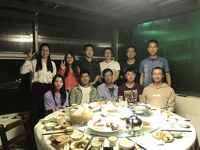

# 云南民族大学吴海锋团队

### About Us/关于团队

云南民族大学吴海锋教授团队名称为“云南省高校智能传感网络及信息系统科技创新团队”，前身为始建于2010年的云南民族大学“传感器网络技术与信息处理创新团队”，于2017年初获云南省教育厅立项，成为第五批云南省高等学校科技创新团队之一。

团队以云南民族大学电气信息工程学院为核心单位，紧密依托通信与信息工程一级学科硕士点发展，以立足云南省情、服务边疆民族的方针从事科学研究，围绕机器学习、神经信号处理、通信信号处理以及与云南密切相关的养路机械、物流系统等方面，采用信息化、网络化、智能化技术展开研究。

多年来，本团队始终坚持在科研和教学第一线，把提高科研教学质量作为重心。团队在提高科研质量的同时，不断跟踪学科的热点，取得了一系列的科研成果，团队学术研究气氛十分浓厚，近几年，团队在承担各类国家级、省部级科研项目数，发表SCI论文质量，获得奖项等方面均呈上升趋势。

### Team Leader/带头人

吴海锋，男，1977年6月生，云南昆明人，云南省中青年学术带头人，云南省高校智能传感网与信息系统创新团队带头人，云南民族大学特聘教授，云南省通信学会理事。提出“导学共同体”教学方法：指导研究生分获省和校优秀硕士论文2 和7 篇，省研究生成果奖1 次，第一作者和通讯作者指导发表IEEE Trans电子计算机公认顶刊代表论著10余篇(中科院分区顶刊，中国计算机学会、中国自动化学会推荐A刊)；以“研哺教，教馈研”模式开展案例教学，获“伍达观”奖教金、“红云园丁奖”、“教师技能赛”和“优秀教师”等奖项，指导学生获省大创奖、大创国家级立项。一直从事信息学科研究，主持国家级项目3项，相关成果得到国内相关专家的高度评价：达到国内领先水平，获省自然科学奖。业绩受业內认可，多机构聘为专家：长江学者评议专家，全国研究生教育评估检测专家，国家自科基金评审专家，省工业信息化咨询专家，省重点领域科技计划、科技奖评审专家，省通信正高工程师评审委员，“挑战杯”省评审委员。

主要经历 | 
------------ | -------------
2012/11至今| 云南民族大学, 电气信息工程学院,教授（破格）
2010/11~2012/10| 云南民族大学, 电气信息工程学院,副教授（破格）
2009/07~2010/10| 云南民族大学, 物电学院,讲师
2007/07~2009/07| 中山大学, 昆船博士后工作站,博士后
2004/09~2007/07| 中山大学, 信科学院,博士
2001/09~2004/07| 云南大学, 信息学院,硕士
1999/07~2001/02| 上海航天设备制造总厂,技术员
1995/09~1999/07| 南京理工大学, 制造工程学院,学士

# Research/科学研究

### Interest/研究方向

### Selected Publication/论文
- 2022
  - Haifeng Wu, Wei Gao Chongrong Pu & Yu Zeng "Feature selection and cross-validation for physical layer RFID counterfeit tag identification," IEEE Transactions on Instrumentation & Measurement (2022) 
  - Haifeng Wu, Jinling Luo, Xiaoling Lu & Yu Zeng "3D transfer learning network for classification of Alzheimer’s disease with MRI," International Journal of Machine Learning and Cybernetics (2022) ([pdf](./paper/cf07504c-0df4-44f3-a293-3f55a96e4afe.pdf), [code](https://github.com/monk5469/AD MRI classification))
- 2021
  - Haifeng Wu , Dong Li, Mingzhi Lu, Yu Zeng "fMRI activations via low-complexity second-order inverse-sparse-transform blind separation," Digital Signal Processing Volume 117, October 2021, 103137," ([pdf](./paper/lidong2021DSP.pdf), [code](https://github.com/monk5469/GFS_GCS_fMRI))
  - Haifeng Wu, Xiaogang Wu, Yi Li and Yu Zeng "Collision Resolution with FM0 signal separation for short-range random multi-access wireless network,"  IEEE
Transactions on Signal and Information Processing over Networks," ([pdf](./paper/01XiaoGang2021Trans.pdf), [code](https://github.com/monk5469/collision-separation))
  - Haifeng Wu，Lingxu Kong，Yu Zeng, Han Bao, "Resting-state Brain Connectivity via Multivariate EMD in Mild Cognitive Impairment," IEEE Transactions on Cognitive and Developmental Systems, Early Access, 2021.([pdf](./paper/Proof_TCDS3054504.pdf), [code](https://github.com/monk5469/MEMD_MCI_fMRI))

- 2020
  - Junzhi Li, Haifeng Wu* and Yu Zeng, "Recovery of Collided RFID Tags With Frequency Drift on Physical Layer," IEEE/CAA J. Autom. Sinica, vol. 7, no. 6, pp. 1593-1603, Nov. 2020. ([pdf](./paper/JunZhi_jas.2019.1911720.pdf))
  - Jingyi Feng, Haifeng Wu, Yu Zeng, Yuhong Wang, “Weakly supervised learning in neural encoding for the position of the moving finger of a macaque”, Cognitive Computation, 12(5), Sep. 2020. ([pdf](./paper/Feng_weakly.pdf))
  - Haifeng Wu, Mingzhi Lu, Yu Zeng, State Estimation of Hemodynamic Model for fMRI Under Confounds: SSM Method, IEEE Journal of Biomedical and Health Informatics, 2020, 24(3):804-814. ([pdf](./paper/WuLu2019.pdf), [code](https://github.com/monk5469/CSCKF-CSCKS))

- 2019
  - Haifeng Wu, Jingyi Feng, and Yu Zeng, Neural Decoding for Macaque’s Finger Position: Convolutional Space Model, IEEE Transactions on Neural Systems and Rehabilitation Engineering, 2019, 27(3):543-551.  ([pdf](./paper/feng2019Trans.pdf))
  - Meng Gao， Haifeng Wu*, Yong Shen，Xia Wang，A peak detection algorithm adopting magnetic sensor signal for rail spike location in tamping machine, Advances in Mechanical Engineering, 2019, 11(11): 1-13. ([pdf](./paper/PeakDetection_Gao.pdf))
 
- 2018
  -  Haifeng Wu, K Yang, Y Zeng, Sparse Coding and Compressive Sensing for Overlapping Neural Spike Sorting, IEEE Transactions on Neural Systems and Rehabilitation Engineering, 2018, 26(8): 1516–1525. ([pdf](./paper/wu2018_SpikeSorting_trans.pdf)) 
  -  Haifeng Wu, Yang Wang, Yu Zeng, Capture-aware Bayesian RFID Tag Estimate for Large-scale Identification, IEEE/CAA Journal of Automatica Sinica, 2018 , 5(1) : 119-127. ([pdf](./paper/Capture-aware_AUTO.pdf))
  - 李俊志, 吴海锋*, 曾玉. 频率漂移的RFID冲突标签的物理层恢复 (Recovery of Collided RFID Tags with Frequency Drift on Physical Layer), 电子学报, 2018, 46 (8): 2004-2010 
  - 杨凯, 吴海锋*, 曾玉, 压缩感知的重叠神经元峰电位信号分类, 电子学报, 2018, 46 (3): 748-754

- 2017
  - 薛明龙, 吴海锋* , 曾玉, 无监督的猕猴运动皮层锋电位信号CKF解码 (Unsupervised CKF Decoding for Macaque Motor Cortical Spikes), 自动化学报, 2017, 43(2):302-312

- 2016
  - Hanjun Duan, Haifeng Wu * , Yu Zeng, Yuebin Chen, LS Channel Estimation and Signal Separation for UHF RFID Tag Collision Recovery on the Physical Layer, Sensors, 2016,  16(4):1-13. ([pdf](./paper/sensors-16-00442.pdf)) 
  - 王阳, 吴海锋* , 曾玉, 稠密RFID标签环境下捕获感知贝叶斯标签估计, 计算机研究与发展, 2016, 53(6):1325-1331 
  - 段汉俊, 吴海锋* , 曾玉, 物理层超高频射频识别标签信号分离中的信道估计, 电子与信息学报, 2016, 38(1):119-126 

- 2015
  - Haifeng Wu, Yu Zeng, Passive RFID Tag Anti-collision Algorithm for Capture Effect, IEEE Sensors Journal, 2015, 15(1): 218-226. ([pdf](./paper/Passive RFID Tag Anti-collision Algorithm for Capture Effect.pdf)) 
  - Yang Wang Haifeng Wu * , Yu Zeng, Capture-Aware Estimation for Large-scale RFID tags Identification, IEEE Signal Processing Letters, 2015, 22(9): 1274-1277. ([pdf](./paper/wang2015.pdf))
  - 吴海锋, 曾玉, 物理层的超高频RFID标签信号分离, 通信学报, 2015, 36(2):215-222

- 2010 ~ 2014
  - Haifeng Wu, Y. Zeng, J. Feng, Y. Gu,“Binary tree slotted aloha for passive RFID tag anti-collision,” IEEE Transactions Parallel and Distributed Systems, Vol. 24, no. 1, pp. 19-31, 2013. ([pdf](./paper/binary tree.pdf))
  - Haifeng Wu, Y. Zeng, “Efficient Framed Slotted ALOHA Protocol for RFID Tag Anti-collision,” IEEE Transactions Automation Science and Engineering, vol. 8, no. 3, pp. 581-588, 2011. ([pdf](./paper/efficient framed aloha.pdf))
  - Haifeng Wu, Y. Zeng, “Bayesian tag estimate and optimal frame length for anti-collision aloha RFID system,” IEEE Transactions Automation Science and Engineering, vol. 7, no. 4, pp. 963-969, 2010. ([pdf](./paper/Bayesian RFID Tag estimate.pdf))
  - Xi Yang, Haifeng Wu*, Yu Zeng, Fei Gao, “Capture-Aware Estimation for the Number of RFID Tags with Lower Complexity,” IEEE Communications Letters, Vol. 17, no. 10, pp 1873-1876, 2013. ([pdf](./paper/capture_aware.pdf))
  - 吴海锋, 曾玉, 凌永发. 捕获效应下RFID 标签的ABTSA 防冲突协议，自动化学报，40（3）：506-515, 2014 (EI)
  - 杨茜，吴海锋*, 曾玉. 捕获效应下RFID标签的CATPE防冲突协议，通信学报， 35(7):215~222, 2014 
  - 吴海锋，曽玉. 无需标签数估计的被动式RFID标签防冲突BTS协议,计算机研究与发展, 49（9）：1959-1971, 2012
  - 吴海锋，曽玉. 自适应帧ALOHA 的RFID 标签防冲突协议,计算机研究与发展,48（5）：802-811, 2011 
  - 吴海锋，曽玉. RFID 动态帧时隙ALOHA 防冲突中的标签估计和帧长确定,自动化学报，36 (4): 620-624, 2010

- Before 2010
  -  Haifeng Wu，X. Dai，H. Zhang. Semi-blind channel estimation for the uplink of MC-CDMA systems with timing offset, IET Communication, Vol.3, Iss.2,pp.185-197,2009
  - 吴海锋，戴宪华，梁建清. 带有时偏的MC-CDMA上行链路的盲信道估计，通信学报，28(1):8-16, 2007
 

### Grant/科研项目

- 认知风险控制的非遍历信号处理研究,2022.01 - 2025.12,国家自然科学基金, 主持人：吴海锋

- SSM视角下δ形传输拥塞的物理层解决:以UHF_RFID为例, 2018. 1 ~2021.12, 国家自然科学基金, 主持人：吴海锋 

- UHF_RFID的容迟性拥塞物理层解决：SSM模型方法, 2018. 4 ~2021. 4, 云南省应用基础研究重点项目, 主持人：吴海锋

- 云南省高校智能传感网络及信息系统科技创新团队, 2016.12 ~2019.12, 云南省高校科技创新团队建设项目, 主持人：吴海锋

- 云南省中青年学术带头人后备人才, 2014. 4 ~2017. 4, 云南省人才项目, 主持人：吴海锋

- 云南地区RFID物流供应链的仿生定位感知 MAC协议研究, 2013. 1 ~2016.12, 国家自然科学基金, 主持人：吴海锋

- 云南民族地区物流管理中多RFID标签冲突研究, 2011.10 ~2014. 9, 云南省应用基础研究面上项目, 主持人：吴海锋

# Fellowship/人才培养

  

    
- 硕士生
  - 2021级 陈珂，涂中华，普崇荣，汪汗青，田建成，马佳
  - 2020级 保涵，郭佳雯，蒲长林，晏洁，高威
  - 2019级 桂妮霞, 罗金玲, 李栋
  - 2018级 陆小玲，孔伶旭，吴晓刚
  - 2017级 李毅，高萌，陈安莹
  - 2016级 冯景义，吴庆贺，鲁明志
  - 2015级 杨凯，李俊志
  - 2014级 薛明龙，刘汉军，院冬珠
  - 2013级 段汉俊，王阳, 李桢
  - 2012级 朱芹，胡上贤
  - 2011级 杨茜
  - 2010级 谭元，刘静
  - 2009级 邓中婷
  
- 免试硕士生
  - 2021级 马佳
  - 2020级 保涵，郭佳雯
  - 2019级 桂妮霞, 罗金玲
  - 2018级 陆小玲
  - 2011级 杨茜

# Course/主讲课程

### -通信系统仿真(研)
- [讲义及代码](./course/ComSim.rar)
### -现代信号处理
- [讲义](./course/SigProc.pdf) 
- [习题](./course/SigExercise.doc)
- [代码](./course/SigCode.rar) 
### -EDA
- [习题](./course/EDAExe.rar)
- [实验](./course/EDAExp.zip) 
### -DSP
- [习题](./course/DSPExe.rar)
- [实验](./course/DSPExp.zip) 

# What's New/最新动态

### January，2022
.祝贺高威论文被IEEE Transactions on Instrumentation & Measurement接受

February,2022,.祝贺罗金玲论文被International Journal of Machine Learning and Cybernetics接受

Jun,2021,祝贺李栋论文被Digital Signal Processing接受

June,2021祝贺吴晓刚论文被IEEE Transactions on Signal and Information Processing over Networks接受

January,2021祝贺孔伶旭论文被IEEE Transactions on Cognitive and Developmental Systems接受

Jun,2020. 祝贺桂妮霞获2020年云南省教育厅研究生科研基金项目资助

Jun,2020. 2020年云南民族大学“信息与通信工程”一级学科硕士校外调剂已经结束，复试结果已公示，敬请关注 [云南民族大学电电气信息工程学院](http://dxxy.ynni.edu.cn/)

May,2020. 祝贺高萌获得2020年云南民族大学“信息与通信工程”优秀硕士论文

Apr,2020. 祝贺冯景义获得2020年云南省首届研究生优秀成果奖

# Join Us/联系我们

联系人 | 吴老师
------------ | -------------
地址| 昆明市云南民族大学雨花校区电信学院
邮编| 650504
Email | whf5469@gmail.com

<!-- 不蒜子计数 -->

| 总访问量  次 
| 总访客数  人 
<!-- 不蒜子计数 -->

<!-- 不蒜子计数初始值纠正 -->

